# Installation Guide for the DDoS Info Sharing (DIS) Netscout Arbor Sightline Monitor/Client

### v 0.6

## 1. Introduction

The Arbor Sightline Monitor/Client interfaces with an Arbor/NetScout Sightline
9.x system to receive notifications from the system when DDoS attacks are
detected and upload the relevant metadata (most specifically the source IP
addresses) into the DIS server database. From the DIS database, owners of the
source IP address can determine if and how devices on their networks are
contributing to DDoS attacks.

This guide details how to setup the CableLabs DDoS Information Sharing (DIS)
Monitor/Client for Sightline 9.x systems.

## 2. Create an API key for the Monitor/Client

Using the provided credentials, go to <https://dissarm.net/clients> and select
"Provision New Client."

NOTE: If you don’t already have credentials for the DIS management system,
CableLabs will create one or more logins for your organization and provide
initial credentials.

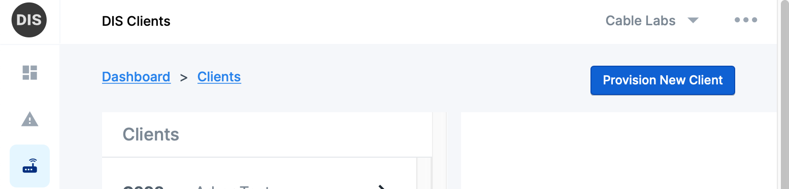

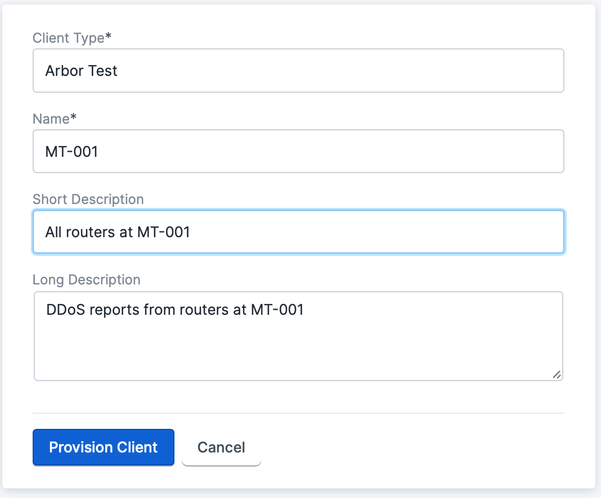

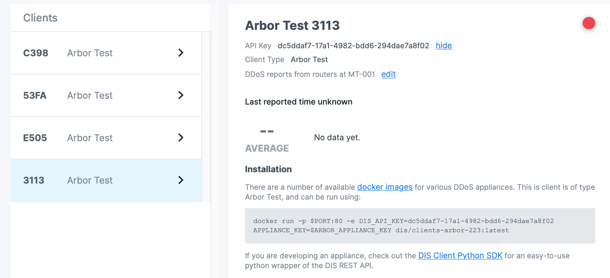

Once completed, make note of the "API Key" to use below.

Note: Disregard the "Installation" instructions provided in the UI for the
time-being. These will be updated to reflect these installation instructions in
a future update of the DIS backend.

## 3. Create a sightline API key

If you don’t already have an API key setup, generating an Arbor API key requires
access to the Arbor Sightline CLI. This is described in the "Enabling Customers
to View Sightline Data in the Web Services API" section of the *Sightline and
Threat Mitigation System User Guide*.

From the Netscout CLI, enter the following command:

```
/ services aaa local apitoken generate user_name "token_description"
```

If an API token exists (or if you’re not sure one exists), use:

```
/ services aaa local apitoken show
```

To show any active API tokens. Make note of the Arbor REST API token for the
steps below.

## 4. Install the DDoS Info Sharing (DIS) Monitor/Client (v2)

The DIS Arbor Monitor/Client requires the following:

-   An Arbor/Netscout Sightline 9.x (Peakflow SP 9.1+) server with:

    -   Accessibility from the server hosting the DIS Arbor Monitor on port 443

    -   Optionally, a https server certificate that the DIS Client can use to
        validate the server (when configuring the client to access the SP API
        using https)

    -   Optionally, a root certificate that allows for validation of SP webhook
        calls (when configuring SP with https-based webhooks)

-   A server to host the Monitor/Client with:

    -   Python 3.6 (or higher) or the Docker container management system

    -   Support for incoming TCP connections established from Arbor Netscout
        (http or https)

    -   Access to the Arbor Netscout REST API (e.g.
        http://arbor-hostname-or-ip/)

    -   A network connection allowing outbound HTTPS connections (specifically
        to <https://dissarm.net/>)

    -   Optionally, a https server certificate that the Sightline 9.x system can
        use to validate the server (when configuring Sightline webhooks using
        https)

    -   Optionally, a root certificate that allows for validation of Sightline
        API REST calls (when configuring the DIS Client with an https URI)

For installing the DIS Arbor Monitor/Client, perform the following:

1.  **Retrieve the latest Docker management script for the DDOS Info Sharing client:**
    
    ```
    wget https://raw.githubusercontent.com/cablelabs/dis-arbor-monitor/master/arbormon-container.sh
    wget https://raw.githubusercontent.com/cablelabs/dis-arbor-monitor/master/arbormon-container.conf
    ```

2.  **Install the script:**

    ```
    sudo mkdir /etc/dis-arbor-monitor/
    sudo install -v -o root -m 755 -D -t /etc/dis-arbor-monitor/arbormon-container.sh
    sudo install -v -o root -m 600 -D -C -t /etc/dis-arbor-monitor/arbormon-container.conf
    ```

3.  **Configure the settings for your environment:**

    ```
    sudo vim /etc/dis-arbor-monitor/arbormon-container.conf
    ```

    Which should contain settings for the following variables:

    -   `DOCKER_CMD` to the command to execute to invoke Docker (just "docker" if the
        user is already in the "docker" group or "sudo docker" if the user is not)

    -   `DEF_IMAGE_LOCATION/TAG` to whatever values are provided by the DIS project
        integrator

    -   `DEF_CONTAINER_NAME` should be set to "dis-arbor-monitor-service"

    -   `DEF_DEBUG` can be set to "True" to enable debug logging. The default is for
        debug logging to be disabled.

    -   `DEF_TLS_CERT_CHAIN_FILE/KEY_FILE` should be set to the paths containing the
        TLS/HTTPS certificate and private key for the server running the monitor.
        These should only be set if (a) the Arbor web hook is setup with an https
        URI, and (b) when a HTTPS web proxy isn’t being used to handle the HTTPS
        connection (e.g. nginx)

    -   `DEF_BIND_PORT/ADDRESS` need to be set in accordance with how the Arbor
        webhook is setup. If the webhook is "http" (with the default port) than
        these should be either "0.0.0.0" and "80" or to be more explicit, the IP
        address of the Arbor-accessible interface and "80". If a https proxy is
        used, these should be set to "127.0.0.1" and some arbitrary port, such as
        "8080".

    -   `DEF_ARBOR_REST_API_PREFIX` should be set to the http or https URI prefix for
        the Arbor NetScout REST API. Usually this will just be set to a URI of the
        form "<https://arbor-netscout-hostname.acme.com/>"

    -   `DEF_ARBOR_REST_API_TOKEN` should be set to the key setup in the previous
        section (see section "Create a sightline API key")

    -   `DEF_REPORT_CONSUMER_API_KEY` is set to the API key created in the previous
        section (see section "Create an API key for the Monitor/Client")

    -   `DEF_REPORT_CONSUMER_HTTP_PROXY` can be set to the URI of an HTTP/HTTPS proxy.
        (e.g. "http://10.0.1.11:1234" or "https://proxy.acme.com:8080")

    -   `DIS_ARBORMON_WEBHOOK_TOKEN` can be set to a random string which is provided
        in the webhook URI as a way to authenticate the webhook invocation. e.g.
        "openssl rand -hex 10"

    -   `DEF_MAX_QUEUED_REPORTS` is set to the number of attack reports that the
        client will queue if/when communication is lost with the DIS backend server.
        If unset, the client will queue indefinitely.

    -   `DEF_SYSLOG_SERVER` can be set to the hostname/address of a syslog server
        listening for syslog events on UDP port 514 (e.g. "logserve.acme.com") or to
        the port designated after a ":" (e.g. "logserve.acme.com:5514"). Any
        INFO-level logging (or higher) will be sent to the designated SYSLOG server
        via UDP (in addition to any other syslog destinations set).

    -   `DEF_SYSLOG_TCP_SERVER` can be set to the hostname/address of a syslog server
        listening for syslog events on TCP port 601 (e.g. "logserve.acme.com") or to
        the port designated after a ":" (e.g. "logserve.acme.com:5601"). Any
        INFO-level logging (or higher) will be sent to the designated SYSLOG server
        via TCP (in addition to any other syslog destinations set).

    -   `DEF_SYSLOG_SOCKET` can be set to the filename of a syslog socket file. Any
        INFO-level logging (or higher) will be sent to the designated SYSLOG socket
        (in addition to any other syslog destinations set).

    -   `DEF_SYSLOG_FACILITY` can be set to the desired syslog facility code (an
        integer). If unset any syslog logging will be logged to facility LOG_USER.

    -   `DEF_LOG_PREFIX` can be set to an arbitrary string that will prefix all
        logging messages from the client – both within the docker container and
        messages logged via syslog

    -   `DEF_LOG_REPORT_STATS` can be set to a positive integer representing the
        frequency (in minutes) where the client will periodically perform INFO-level
        logging reporting the number of attack events and source IP addresses
        reported during the last time period. e.g.

        ```
        STATUS REPORT: Sent 11 reports (with 1789 source IPs) in 5.00 minutes
        STATUS REPORT: Sent 9 reports (with 2312 source IPs) in 5.00 minutes
        STATUS REPORT: Sent 17 reports (with 2812 source IPs) in 5.01 minutes 
        ```

    -   `DEF_REPORT_STORE_DIR` can be set to a directory where a local report file
        will be written each time an attack is processed, for local processing. If
        unset, report files are not generated by the client.

    -   `DEF_REPORT_STORE_FORMAT` can be set to either "only-source-attributes" or
        "all-attributes". If not set, the default is "only-source-attributes"

        The "only-source-attributes" format includes only information related to the
        attack source – omitting data such as the target IP, source router, and other
        information not related to the attack source. Here’s an example of the
        "only-source-attributes" format:

        ```
        {
            "attack_id": "9902",
            "start_time": "2020-12-04T08:21:52+00:00",
            "stop_time": "2020-12-04T08:27:36+00:00",
            "source_ips": [
                {
                    "address": "61.54.68.28",
                    "max_bps": 68
                }
            ],
            "report-format": "only-source-attributes",
            "report-version": {
                "major": 1,
                "minor": 0
            },
            "attributes": {
                "impact_bps": 60,
                "impact_pps": 0,
                "misuse_types": [
                    "TCP SYN/ACK Amplification"
                ]
            }
        } 
        ```

        The "all-attributes" format includes additional attributes not related to the
        attack source – attributes which are not reported to the DIS backend but which
        may be of interest/use of local facilities. For example the attack target and
        relevant router names will be included in the report. Here’s an example of the
        "all-attributes" format

        ```
        {
            "attack_id": "9902",
            "start_time": "2020-12-04T08:21:52+00:00",
            "stop_time": "2020-12-04T08:27:36+00:00",
            "source_ips": [
                {
                    "address": "61.54.68.28",
                    "max_bps": 68
                }
            ],
            "report-format": "all-attributes",
            "report-version": {
                "major": 1,
                "minor": 0
            },
            "attributes": {
                "direction": "Incoming",
                "fast_detected": true,
                "host_address": "50.202.218.134",
                "impact_boundary": "LV-RTR01",
                "impact_bps": 60,
                "impact_pps": 0,
                "ip_version": 4,
                "misuse_types": [
                    "TCP SYN/ACK Amplification"
                ],
                "severity_percent": 599.0,
                "severity_threshold": 10,
                "severity_unit": "bps",
                "summary_url": "/page?id=customer_summary&gid=135"
            }
        }
        ```

    Here’s an example of the */etc/dis-arbor-monitor/arbormon-container.conf* file:

    ```
    DOCKER_CMD="sudo docker"
    DEF_IMAGE_LOCATION="community.cablelabs.com:4567/dis-docker/dis-arbor-monitor"
    DEF_IMAGE_TAG=latest
    DEF_CONTAINER_NAME=dis-arbor-monitor-service
    DEF_TLS_CERT_CHAIN_FILE=/etc/dis-arbor-monitor/combined.cer 
    DEF_TLS_PRIV_KEY_FILE=/etc/dis-arbor-monitor/private.key 
    DEF_BIND_PORT=8443
    DEF_BIND_ADDRESS=0.0.0.0
    DEF_ARBOR_REST_API_PREFIX=https://arbor-001.acme.com 
    DEF_ARBOR_REST_API_TOKEN=Your-Arbor-API-Token
    DEF_REPORT_CONSUMER_API_KEY=Your-DIS-API-Key
    DEF_REPORT_CONSUMER_HTTP_PROXY=https://proxy.acme.com:8080
    DIS_ARBORMON_WEBHOOK_TOKEN=abcd1234
    DEF_MAX_QUEUED_REPORTS=50
    DEF_DEBUG=False
    DEF_SYSLOG_SERVER=logserver.acme.com
    DEF_SYSLOG_TCP_SERVER=
    DEF_SYSLOG_SOCKET=/dev/log
    DEF_SYSLOG_FACILITY=
    DEF_LOG_PREFIX=acme-dis-client
    DEF_LOG_REPORT_STATS=5
    DEF_REPORT_STORE_DIR=/var/dis-arbor-monitor/reports
    DEF_REPORT_STORE_FORMAT=all-attributes
    DEF_DEBUG=false
    ```

    NOTE: This conf file should have permissions set to prevent it from being
    world-readable if the system is multi-user (e.g. "chmod o-rw
    /etc/dis-arbor-monitor/arbormon-container.conf"). This will require the user
    executing the script to have permissions set to allow access to the file or to
    use "sudo" to execute the script.

4.  **Download the Docker image:**

    ```
    /etc/dis-arbor-monitor/arbormon-container.sh docker-pull
    ```

5.  **Start the DIS Arbor Monitor Docker container:**

    ```
    /etc/dis-arbor-monitor/arbormon-container.sh docker-run
    ```

6.  **Check for successful startup:**

    ```
    /etc/dis-arbor-monitor/arbormon-container.sh docker-logs
    ```

    On successful startup, the logs should start with something similar to:

    ```
    dis-arbor-monitor: INFO Debug: False
    dis-arbor-monitor: INFO Dry run: False
    dis-arbor-monitor: INFO Bind address: 0.0.0.0
    dis-arbor-monitor: INFO Bind port: 8443
    dis-arbor-monitor: INFO Cert chain file: /app/lib/tls-cert-chain.pem
    dis-arbor-monitor: INFO Cert key file: /app/lib/tls-key.pem
    dis-arbor-monitor: INFO Arbor API prefix: https://arbor-001.acme.com
    dis-arbor-monitor: INFO Arbor API token: Your-Arbor-API-Token
    dis-arbor-monitor: INFO Consumer URL: 
    dis-arbor-monitor: INFO Consumer API key: 
    dis-arbor-monitor: INFO DIS client name: ACME Arbor 001
    dis-arbor-monitor: INFO DIS client organization: Acme Corp
    dis-arbor-monitor: INFO DIS client description: Data from Arbor Netscout 001 
    dis-arbor-monitor: INFO DIS client contact: dis-admin@acme.com
    dis-arbor-monitor: INFO Client type name: Arbor Ingester 001
    dis-arbor-monitor: INFO Client type maker: Arbor
    dis-arbor-monitor: INFO Client type version: 0.0.0
    ```

## 5. Configure Arbor Netscout to notify the Monitor/Client

To configure Arbor NetScout to notify the DIS monitor/client, perform the
following:

1.  **Setup a Managed Object with suitable DDoS notification limits:**

    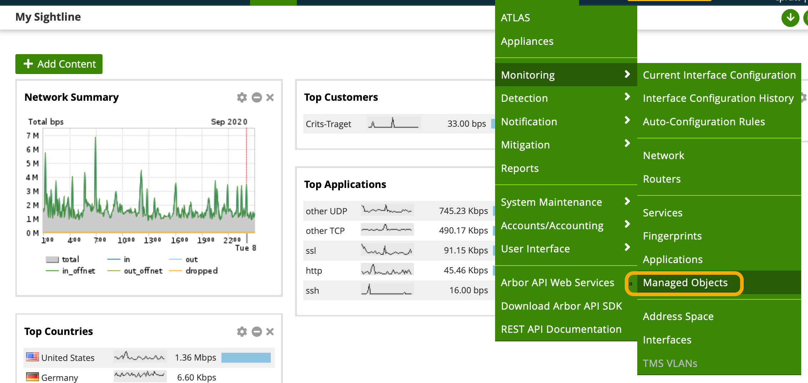

    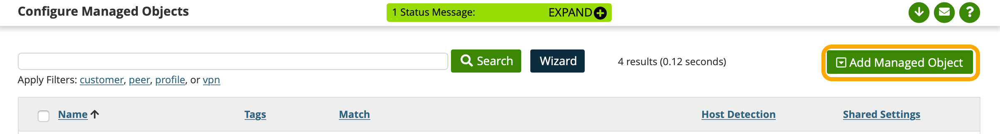

    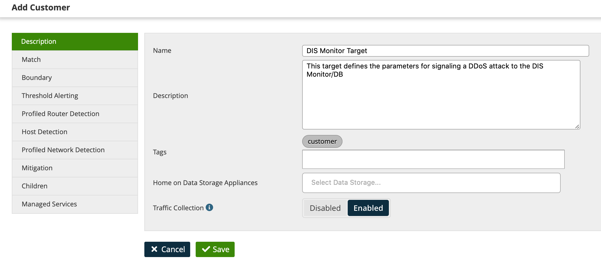

    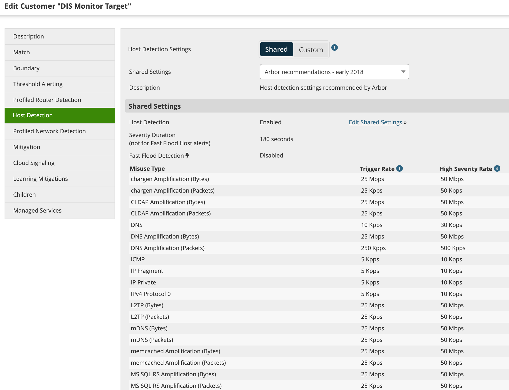

    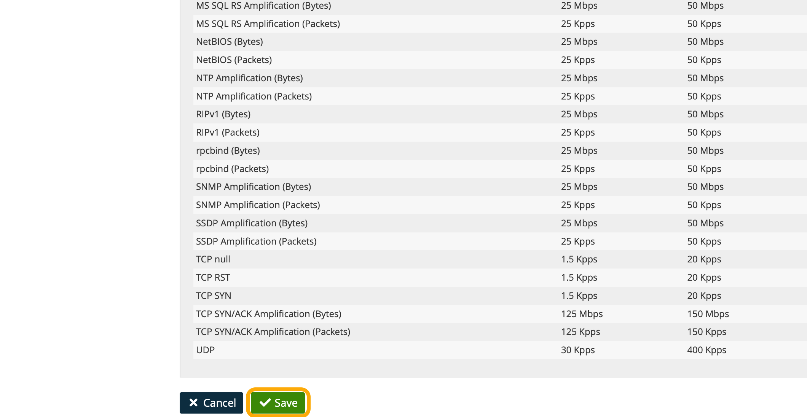

2.  **Create a notification group:**

    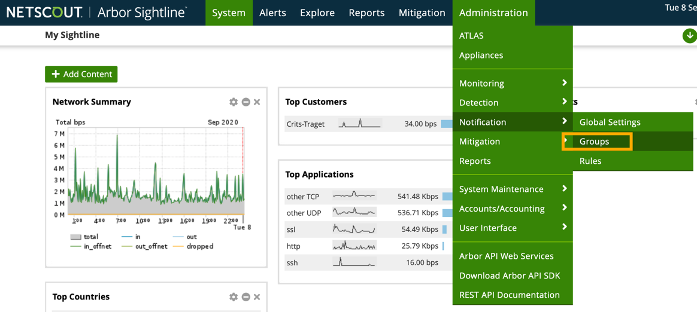

    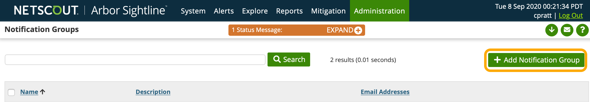

    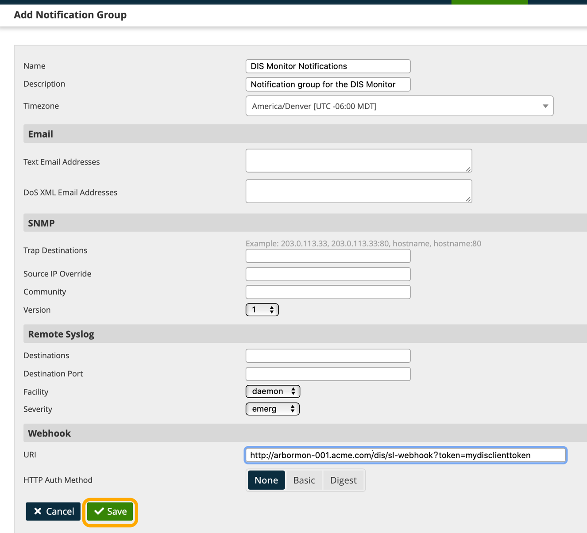

    The webhook "URI" provided here is just an example. This field must be
    coordinated with the configuration of the DIS Monitor/Client as described in
    Section 4 (Install the DDoS Info Sharing (DIS) Monitor/Client (v2)).

    If the DIS client is configured to listen for http notifications (with no TLS
    cert configured), then a URI of the form "http://fqdn-or-ip/dis/sl-webhook"
    will be an appropriate Webhook URI. If https is desired, then the form must
    be "https://fqdn-or-ip/dis/sl-webhook" where the host/service handling the
    webhook call has a TLS cert registered for the fqdn and signed by a CA
    trusted by the Arbor Netscout server (the service’s cert is signed directly
    or indirectly by a CA trusted by the server). Note than in either case the
    default http/https port can be over-ridden by appending ":portnum" to the
    webhook URI.

    In addition to configuring the protocol and URI path, the DIS client can be
    configured to authenticate webhook invocations via a "token" parameter. For
    example a webhook URI of the form:

    `https://fqdn-or-ip/dis/sl-webhook?token=03240717821fe3531b13`

    Would be required to invoke the DIS client webhook if it’s configured to
    only allow webhook invocations with the provided token. Note that this form
    is only reliable when used with https – since the URI (including the token)
    will not be encrypted on http connections.

3. **Setup a notification rule for the Managed Object setup above to utilize the Notification Group containing the webhook:**

    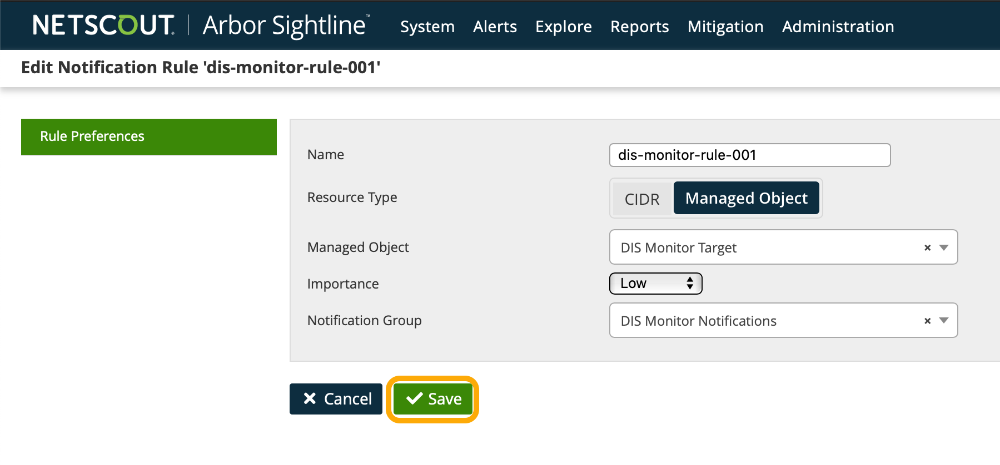

    * Note: Alternatively, a Notification Rule can be setup with a CIDR instead of a Managed Object. 
            For example, a CIDR of "0.0.0.0/0"/"0::0" will allow the DIS Notification Group to be triggered
            for all DDoS attacks detected by Arbor NetScout. 
    
    Once the changes are made, the changes must be committed by selecting "Commit Config" from the web interface:

    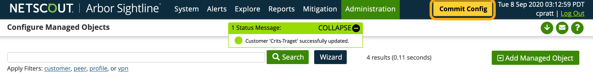

    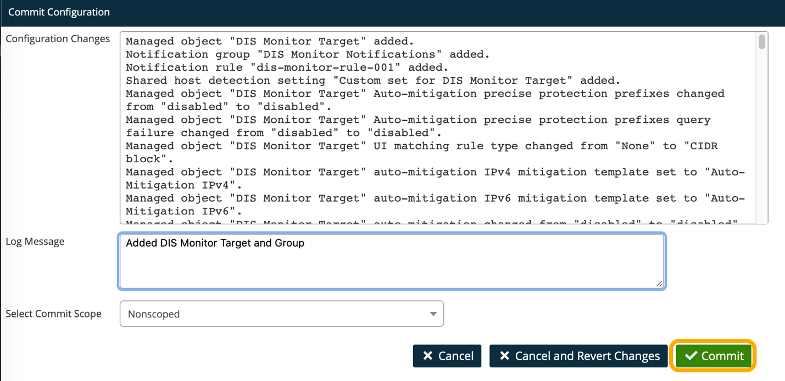

4. **Configure webhook notification limits to prevent excessive queuing of webhook notifications.**

    Arbor Sightline will only consider a webhook "invoked" if it’s able to POST
    the webhook notification body to the configured webhook endpoint URI(s) and
    the endpoint returns a HTTP 200 (success) status code. If the webhook isn’t
    successfully invoked, Sightline will attempt to invoke the endpoint again,
    after a period, and will continue to do so until the endpoint is
    successfully invoked.

    If there’s a concern that Sightline won’t be able to connect to the DIS
    client due to network connectivity issues or regular maintenance, you may
    want to configure Sightline to limit its retry behavior – since it can
    impact the memory usage and performance of the system.

    The following options can be set to control the notification behavior via
    the Arbor Sightline API:

    -   The "notification webhooks retry_count_limit" and "notification webhooks
        retry_count_max set" variables will limit the number of times a webhook will
        be invoked for a particular attack report

    -   The "notification webhooks retry_seconds_limit" and "notification webhooks
        retry_seconds_max" will control the retry frequency for webhook
        notifications for a particular attack report

    For example, to set the webhook notification to perform no more than 10
    notifications per attack – with 1 minute between notifications, the
    following commands can be invoked on the Sightline CLI:

    ```
    / services sp notification webhooks retry_count_limit enable
    / services sp notification webhooks retry_count_max set 10
    / services sp notification webhooks retry_seconds_limit enable
    / services sp notification webhooks retry_seconds_max 60
    ```

## 6. Validation

The information in this section can be used to validate and/or debug the 
communication between the DIS Arbor Monitor and the Arbor Netscout and DIS
backend systems.

### Client Startup

On startup, the DIS Arbor NetScout client monitor will attempt to connect to 
the Arbor Netscout API and the DIS backend API using the configured API keys. 
To confirm that the client was able to connect successfully, use the following 
command to examine the client log:

```
/etc/dis-arbor-monitor/arbormon-container.sh docker-logs
```

On successful startup, with `DEF_DEBUG` set to `True`, the logs should start with something similar to:

```
INFO Debug: True
INFO Dry run: False
INFO Bind address: 0.0.0.0
INFO Bind port: 9080
INFO Webhook token: ... ...
INFO Cert chain file: None
INFO Cert key file: None
INFO Arbor API prefix: https://arbor-001.acme.com
INFO Arbor API token: ... ...wxyz
INFO DIS server API URI: https://api.dis-fqdn.example
INFO DIS server API key: ... ...2112
INFO DIS server max queued reports: 0
INFO HTTP Proxy: None
INFO Periodic report stats logging interval (minutes): 15
INFO Syslog UDP server: None
INFO Syslog TCP server: None
INFO Syslog socket: None
INFO Report storage directory: None
INFO Report storage format: only-source-attributes
```

When the monitor/client successfully connects to the DIS backend server,
you should see log entries similar to the following in the log:

```
DEBUG Starting new HTTPS connection (1): api.dis-fqdn.example:443
DEBUG https://api.dis-fqdn.example:443 "GET /v1/client/me?api_key=....
INFO DIS client name: Arbor 1
INFO DIS client organization: Acme Corp
INFO DIS client description: Data from Arbor Netscout 001
INFO DIS client contact: dis-admin@acme.com
INFO Client type name: Arbor Ingester 001
INFO Client type maker: Arbor
INFO Client type version: 0.0.0
```

If the log contains errors connecting to the DIS backend server, check the
`DEF_REPORT_CONSUMER_API_URI` and `DEF_REPORT_CONSUMER_API_KEY` settings
in the "arbormon-container.conf" file. 
And if your network only allows HTTP connections via proxy, set the
`DEF_REPORT_CONSUMER_HTTP_PROXY` setting (described above).

When the monitor/client successfully connects to the Arbor NetScout 
Sightline REST API, you should see log entries similar to the following in 
the log:

```
DEBUG Starting new HTTP connection (1): https://arbor-001.acme.com
DEBUG https://arbor-001.acme.com:443 "GET /api/sp HTTP/1.1" 200 3316
INFO Found Arbor Sightline SP API version 7 at https://arbor-001.acme.com:443
```

If there are errors at startup connecting to the Arbor Sightline API,
(e.g. it doesn't report the API version), check the
`DEF_ARBOR_REST_API_PREFIX`, `DEF_ARBOR_REST_API_TOKEN`, 
and `DEF_ARBOR_REST_API_INSECURE` settings in the "arbormon-container.conf" file. 
And double-check the API key via the Sightline shell.

###### Note: Once initialization is verified to be working, `DEF_DEBUG` should be set to `False` to avoid excessive logging and potential logging of API keys.

### Webhook Notifications

To test that the client can receive webhook notifications on the 
client/monitor host, you can run the following curl command on the host:

```
curl -s -X POST 'http://127.0.0.1:8080/dis/sl-webhook' \
-H 'Content-Type: application/json' \
-d '{"data": {"attributes": {"alert_class": "test","alert_type": "just_a_test"}},
     "id":"000000"}'
```

With the port number (e.g. `8080`) matching the value of the
`DEF_BIND_PORT` setting in the "arbormon-container.conf" file.

If the webhook invocation is successful, you should see log entries similar to the following:

```
DEBUG Sightline notification payload:{
   "data": {
      "attributes": {
         "alert_class": "test",
         "alert_type": "just_a_test"
      }
   },
   "id": "000000"
}
INFO Ignoring alert regarding non-DOS attack (attack ID None is a test/just_a_test alert)
127.0.0.1:51799 POST /dis/sl-webhook 1.1 200 44 1148
```

If this test is successful, you can run the test using the verbatim URL configured
above in the Arbor NetScout Notification Group. For example:

```
curl -s -X POST 'https://arbormon-001.acme.com:8443/dis/sl-webhook?token=mydisclienttoken' \
-H 'Content-Type: application/json' \
-d '{"data": {"attributes": {"alert_class": "test","alert_type": "just_a_test"}},
     "id":"000000"}'
```

If this test is also successful, run this same command from another host and, 
ideally, from a shell on the Arbor Netscout system itself. 

* Note: If custom/enterprise X.509 certificates are configured for the DIS client 
  (using the `DEF_TLS_CERT_CHAIN_FILE` and `DEF_TLS_PRIV_KEY_FILE` options)
  then use the curl `--cacert` followed by the enterprise CA cert chain file or the 
  `--insecure` flag to disable cert chain checks when self-signed certificates are 
  being used.
* Note: Ensure that your network allows communication from the Arbor NetScout 
  system the webhook is invoked from to the host running the client/monitor
  on the configured port.

### Normal Operation

When an attack is detected by Netscout, and the webhook endpoint is invoked,
the first indication you will see in the DIS Arbor monitor/client log will be 
an entry of the form:

`INFO Received notification of ONGOING attack (ID: 6831)`

Then once the attack is completed – and the attack metadata and source IP
addresses have been determined – you should see log entries of the form:

```
INFO Received notification of COMPLETED attack (Attack ID: 2112)
INFO Attack ID 6831: Misuse Types: None
INFO Attack ID 6831: Start/stop time: 2020-09-08T22:51:19+00:00/2020-09-08T22:56:36+00:00
INFO Attack ID 6831: Found 19 source IPs
INFO Attack ID 6831: Source IPs (first 50): ['1.2.3.4', '5.6.7.8', '9.10.11.12', '13.14.15.16', ...]
INFO Attack ID 6831: Staged event IDs: ['12345678-abcd-2112-abc123abc123']
INFO Attack ID 6831: Sending report
INFO Attack ID 6831: Report sent
```

If Arbor Netscout indicates that a DDoS attack was detected, and there’s no
corresponding log entry, then double-check the configuration using the steps above. 

